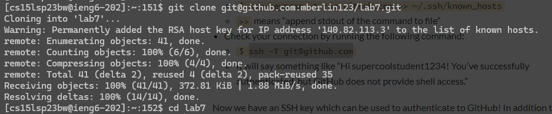

# Lab Report 4

### Introduction:
In this lab report, the steps on how to successfully log into an SSH server and download, edit, and upload changes to a programming project all from the command line are detailed. For each step below, there is a description along with a screenshot and a list of exactly which keys were pressed. Bash, vim, and git (from the command line) are the main tools used in this lab report.

### Step 4: Log into ieng6

In this step, the user logs into ieng6 using the ssh command and the user’s ieng6 username.

**Keys Pressed: "ssh cs15lsp23bw@ieng6.ucsd.edu**

### Step 5: Clone your fork of the repository from your Github account

In this step, the user clones their fork of the repository from their Github account using the git clone command.
The user then enters the downloaded folder using the "cd" command so they can perform the next steps.

**Keys Pressed: "git clone git@github.com:mberlin123/lab7.git", "cd lab7"**

### Step 6: Run the tests, demonstrating that they fail

In this step, the "bash test.sh" command is run and fails due to an error in the "ListExamples.java" file.

**Keys Pressed: "bash test.sh"**

### Step 7: Edit the code file to fix the failing test

In this step, the user fixes the bug in the code file using vim.

**Keys Pressed: "vim ListExamples.java", Down-Arrow, Right-Arrow, I, Backspace, 2,
Escape, ":wq"**

### Step 8: Run the tests, demonstrating that they now succeed

In this step, the "bash test.sh" command is run again and this time succeeds as the bug has been fixed.

**Keys Pressed: Up, Up** (To run **"bash test.sh"**)

### Step 9: Commit and push the resulting change to your Github account

In the final step, the changes are uploaded to the user's github repository. 

**Keys Pressed: "git add ListExamples.java", "git commit -m "Fixed ListExamples.java"", "git push"**
